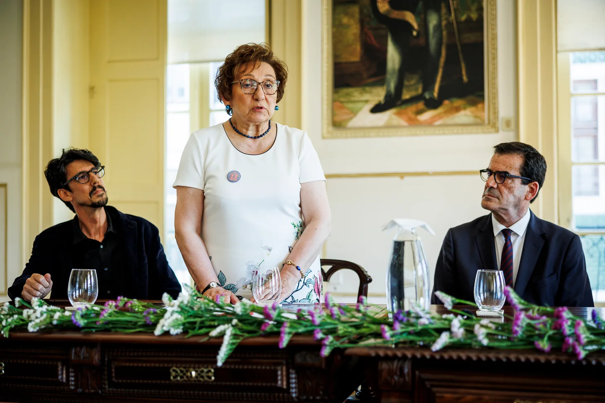
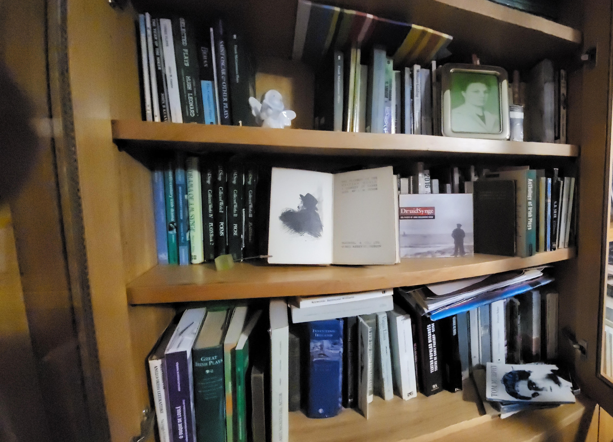

---
 
interviewee: Maria Filomena Louro
interviewer: Maurício Barbosa
job: docente universitário
place of birth: Cantanhede, Coimbra 
date of birth: 
date: 03/04/2024
notes:  
 
---

# Entrevista a Filomena Louro 

<entrevistador><b>Pronto, então a professora não se importa que eu grave o áudio, pois não?</b></entrevistador>

<entrevistado> Não, não, não.</entrevistado>
 
<entrevistador><b>Então, eu queria começar por perguntar sobre a sua origem, sobre de onde vem e o porquê de depois ter vindo parar à Universidade do Minho, sendo que a professora é do Porto, estudou no Porto.</b></entrevistador>
 
<entrevistado>

## Contexto familiar 

Exatamente. Obrigada por esta conversa que o Maurício organizou, e eu vou tentar responder-lhe para dar uma ideia do meu percurso. 
Eu sou do distrito de Coimbra, concelho de Cantanhede, e como muita gente, a minha família migrou para o Porto quando eu tinha 8 anos, portanto, eu fiz metade da escola primária na aldeia e outra metade no Porto. Depois, fiz aí os meus estudos. A razão da saída da minha família da aldeia para o Porto foi para os meus pais terem possibilidades de pagar os estudos a todos os filhos. Nós somos quatro e não havia ensino secundário do Estado no nosso concelho, portanto seria o colégio privado para o meu irmão, e não havia, no concelho, ensino secundário para as meninas. Portanto, as minhas irmãs vieram para o Porto para um internato, e depois quando se avizinhava a ideia de terem de ser quatro filhos fora de casa, a minha mãe resolveu mudar a casa e veio para o Porto, e assim nós pudemos todos ir estudar no ensino oficial e eu acabei por fazer o curso superior também no Porto.

A minha irmã mais velha quis fazer Educação Física, era assim que se chamava o curso naquela altura, e só havia a licenciatura em Lisboa, portanto, depois de a família ter vindo toda para o Porto ter com as minhas irmãs, a minha irmã mais velha foi para Lisboa; já o meu irmão ficou no Porto, e a minha irmã Margarida também fez História no Porto. E eu quando era miúda escolhi línguas, conscientemente, aos 12 anos. Achei que o que eu queria era falar as línguas das outras pessoas que eu fosse conhecer, e talvez também porque tivesse gostado muito das professoras de francês ou do ambiente que se respirava no Instituto de francês, porque eu tinha aulas no Instituto de francês, além das aulas do Liceu. Depois, quando pude ter inglês no que corresponde ao vosso sétimo ano, a escolha foi-se orientando de outra maneira e eu fiquei mais interessada em Inglês e Alemão, portanto continuei a estudar francês no Instituto de francês, no liceu até ao 5º ano ou atual nono, mas depois consegui o francês no Instituto de francês. Estudei alemão, continuei a estudar inglês, e entretanto, eu seria uma candidata a ir para Lisboa ou para Coimbra, porque não havia Germânicas no Porto quando eu escolhi Germânicas, em 1970 - 70-71, 71-72, depois 72-73 é que eu fui para a universidade, portanto, em 1970 não havia Germânicas no Porto -, e eu tive a sorte de que nessa altura o Ministro da Educação Veiga Simão tinha conseguido uma abertura para aumentarem as formações académicas nas universidades. Então abriu aí nas Letras do Porto onde havia Filosofia, Geografia, Românicas e História, também germânicas. Então, eu já fui uma pessoa que não precisou de ir nem para um internato, nem de me mudar de cidade para fazer Universidade. Isso foi muito, penso eu, principalmente, para os meus pais, porque financeiramente é sempre muito complicado.

Eu venho de uma família em que a minha mãe era professora primária e o meu pai era comerciante e lavrador, tinha terras. As pessoas dentro do nosso perfil económico, que chegavam à Universidade, eram 2% da população. A minha mãe fez um curso médio, o meu pai fez só o ensino primário, a minha irmã já estava na universidade quando eu fui... mas eu sempre tive essa consciência, desde cedo, de que mesmo sendo o ensino do Estado eu era privilegiada, porque muito poucas pessoas podiam chegar àquele nível, e ,aliás, da minha turma da escola primária, da minha sala, ninguém foi para a universidade, e depois, do Liceu, ainda hoje tenho amigas, oito pessoas - era um Liceu feminino -, que fizeram todo o percurso Liceal comigo, e a universidade. Portanto, escolhemos a mesma especialização, a mesma alínea - era assim que se chamava-, e então fomos para Germânicas e fizemos o curso. Nós inscrevemo-nos no curso de Filologia Germânica, porque antigamente os estudos eram filológicos, portanto estudo da língua, da literatura e da cultura, em 1972.

Portanto, eu fiz este percurso: a escola da minha mãe, onde a minha mãe era professora; a escola do Porto na Rua do Bonjardim, uma escola mesmo proletária, eu devia ser das poucas miúdas na escola que tinha três ou quatro refeições por dia, os outros comiam uma sopa que levavam à escola, da legião. Era uma zona com muitas ilhas, se conhece a população do Porto, as Ilhas são os bairros proletários, que eram muito densamente populados, isto era para dizer, era uma família por quarto. E eu tinha muitas dessas amiguinhas para quem a universidade era um nome que elas saberiam soletrar, não era nenhuma realidade.

Portanto, da escola primária não tenho nenhuma colega que fosse para a universidade, e do Liceu ainda matenho algumas amigas que fizeram este percurso, algumas foram-se empregar no mundo social, nos negócios, na Segurança Social, e seis delas, ou cinco delas, no ensino secundário. E eu, destas oito pessoas, que ainda hoje nos encontramos, só eu é que vim para o ensino superior, e fui a última a reformar-me. As outras todas já se tinham reformado e estavam-me sempre a perguntar “Quando é que tu vais poder vir almoçar connosco sem estar sempre a correr?”, e isso agora aconteceu, e ,pronto, é outra etapa da minha vida. 

Portanto, a escolha de fazer opção por línguas foi muito cedo, foi uma escolha porque sim e não porque não. Não era aquela situação de que não sabes matemática, vais para letras... por acaso naquela altura, eu tive muitos insucessos a matemática, mas foi uma situação que durou dois anos, depois, na altura em que era para escolher letras ou ciências, as minhas professoras pensavam todas que eu ia para ciências, porque eu tive 17 a matemática no exame, mas, de facto, era só porque eu tinha descoberto a matemática e aquilo era divertidíssimo. Mas, de facto, não era esse o meu interesse. O meu interesse era pelas humanidades. Isso foi interessante porque fez-me escolher a minha carreira sem nenhum preconceito de que eu não era capaz de fazer outra coisa se quisesse, e isso é muito bom, nós podermos escolher ao invés de ser “tens de fazer isto porque as outras coisas são impossíveis” ou, “posso escolher tudo, desde que seja a cor preta” como nos carros Ford. Neste caso, não foi assim. Eu penso que já lhe dei a resposta a essa pergunta, sobre as minhas origens.</entrevistado>
 
<entrevistador><b>Quanto à escolha, depois, da Universidade do Minho, sendo que fez a sua licenciatura no Porto.</b></entrevistador>

## A educação na altura do 25 de abril

<entrevistado>Essa é uma história que é, digamos, paradigmática de um tempo. Falámos há um bocado do  ministro Veiga Simão, com a abertura e a criação de novos cursos no Porto. Portanto, isto ainda foi durante a primavera marcelista, digamos, porque no ano em que eu fiz os exames do secundário - porque era primário, secundário e complementar – portanto, quando eu fiz os exames do vosso nono, foi no ano em que o Salazar caiu da cadeira, depois houve outra pessoa a tomar o governo, que foi o Marcelo Caetano, e com isso veio assim uma expectativa de que podia-se aliviar um bocadinho a tensão e a repressão, e se essas coisas não foram assim muito visíveis, o que foi visível  foi que na educação havia um ministro, que foi o Veiga Simão, que foi uma pessoa que foi capaz de imprimir uma certa modernidade num sistema que estava muito anquilosado. E então abriu novos cursos, logo que eu frequentei em 72, depois falaremos sobre isso.</entrevistado>

<entrevistador><b> Na altura eram cinco anos?</b></entrevistador>

<entrevistado> Eram cinco anos, e antigamente havia licenciaturas de 5 anos, e licenciaturas com tese. Normalmente, as pessoas que faziam licenciatura com tese demoravam mais um ano a fazer a tese, e isso implicava custos, porque as pessoas que tiravam o curso queriam ir trabalhar e se na vez de cinco anos - imagine, por exemplo a minha irmã que estava em Lisboa a estudar, cedo ela começou a dar aulas, para ficar menos pesada para a família - mas, de qualquer das maneiras, se na vez de cinco, fossem seis anos, era um custo muito maior, e então uma das coisas que aconteceu no 25 de Abril foi acabarem com as licenciaturas com tese. Portanto, ainda continuaram com 5 anos, mas, ao fim dos 5 anos tinha-se o diploma de licenciado, e não havia um outro diploma – ao fim ao cabo isso já seria um mestrado, digamos, mas nessa altura não havia mostrados em Portugal.

Portanto, eu escolhi esse curso, escolhi Germânicas, frequentei esse curso, e ao mesmo tempo, em 76/77 - eu agora não me lembro muito bem de quem era o Ministro da Educação nessa altura, já não era o ministro Vítor Alves, porque esses governos foram relativamente breves, um ano mais ou menos – eu lembro-me que o diretor da Faculdade de Letras do Porto convocou os alunos da faculdade - não eramos assim muitos, era praticamente o curso de germânicas mais uns apêndices, porque germânicas naqueles três anos que já estava em funcionamento, éramos para aí 300, e os outros cursos, todos juntos, deviam ser menos de 100, portanto Germânicas eram um curso muito volumoso. 

### Os estímulos para estudar línguas

Ainda não havia computador, portanto não era esse o estímulo para estudar inglês. Eu penso que eram os Beatles, que tornaram a língua inglesa muito atrativa. Eu tive uma educação circundante muito diversificada, porque nós tínhamos na televisão, como era tudo legendado, nós ouvíamos várias línguas, e tínhamos os filmes espanhóis, com a Marisol e com o Joselito, tínhamos os filmes italianos, também com crianças - portanto, os filmes que eu me lembro com 13/14 anos ver -, e depois tínhamos também o cinema francês, e os desenhos animados, o Tom and Jerry e O Gato Félix eram em inglês, mas havia outras línguas, e depois quando as línguas vêm acompanhadas com canções, tornam-se muito apelativas. E eu então tinha muito acesso ao francês às canções francesas, um bocadinho também ao cinema francês, mas depois também tínhamos o espanhol e o Italiano. Portanto, o inglês era só mais um, mas não podemos pôr de lado a Beatlemania nesta altura, porque no momento atual os órgãos culturais dos diferentes países retraíram-se bastante no seu proselitismo, na sua divulgação. Por exemplo, ir ao Instituto francês era ir ter aulas de francês, mas era estar num sítio patrocinado pelo governo francês em que as regras eram as mesmas, respeitavam o país, mas eram um bocadinho diferentes. Eu, por exemplo, podia ler revistas que não encontrava facilmente cá fora ou nem sequer tinha dinheiro paras comprar, e estavam na biblioteca do Instituto francês para nós vermos. No Instituto britânico, também era uma instituição muito enraizada na cultura portuguesa, mas dava-nos acesso a um outro mundo, e estas eram assim umas pequenas ilhas de pensamento divergente do instituído. Sem ter o equipamento crítico para o identificar, eu acho que sentia que ia para outro país quando entrava no Instituto de francês.

## Criação de novas universidades e situação profissionalizante dos professores

Agora, o que aconteceu foi que, para responder à sua pergunta, em 76 /77, o diretor da Faculdade de Letras chamou-nos para nos dizer que a nossa posição de futuros professores do ensino estava um bocado ameaçada, porque o ministério estava a criar universidades novas que iam formar professores que já saíam com o estágio, já saíam profissionalizados, e nós saíamos como uma licenciatura de 5 anos, depois íamos concorrer ao ensino, daríamos aulas e depois íamos concorrer a estágio em exercício, e só abriam estágios de vez em quando. Ora, isso era muito diferente de a pessoa sair já efetiva, numa escola, porque tinha feito estágio e podido concorrer. Eu fiquei a saber dessa ameaça, digamos, que pendia sobre mim, quando eu acabasse o meu curso. Acabei o curso em 77 e depois ganhei uma bolsa de estudo do British Council, e fui para Inglaterra. Depois de acabar a bolsa, fiquei lá a trabalhar como au pair, e, entretanto, era outubro de 77, e a minha família, pelos vistos, em Portugal, não estava muito feliz que eu tivesse gasto 5 anos a fazer um curso Universitário para ser empregada doméstica. E então, comecei a receber telefonemas “Ai, o papá não está bem de saúde, estás tão longe...”, e pronto. Começou aquele jogo de me sentir culpada por estar longe do meu pai e da minha família, e se alguma coisa acontecesse, e vim para Portugal. Então, concorri a mini-concursos e fiquei numa escola do Porto. Mini-concursos, sabe o que é? São uns concursos que são abertos dentro da própria escola para vagas que não foram supridas nacionalmente. Então, as escolas tinham, por exemplo, um horário com 5 horas, ou com 10 horas, não ia o Ministério colocar uma pessoa naquelas circunstâncias, e então as pessoas que estariam ali, que tinham anos de Universidade, ou tinham o sétimo ano do Liceu feito, ou tinha uma experiência, eram seriados, e o mais bem qualificado era chamado para tomar esse lugar. E então, eu em janeiro de 78, fiquei colocada numa escola perto da minha casa, havia um horário com 20 horas. Durante o primeiro período, aquelas crianças não tinham tido aquelas aulas de português e de inglês que eu fui dar. E então, durante o período que eu estive nessa escola, concorri a tudo, depois tinha de concorrer ao secundário ou a outros empregos que aparecessem. E nessa altura, a Universidade do Minho, exatamente aquela que ia tirar os empregos aos professores que sairiam das escolas clássicas, estava a recrutar, e alguém na minha família viu o anúncio e deu-me o recorte do jornal “Olha, a Universidade do Minho está a pedir assistentes para o departamento de inglês ou para a área pedagógica de Inglês”, e eu então escrevi uma carta datilografada - andava também a aprender a escrever na máquina - e mandei para aqui e fui chamada para uma entrevista. Portanto, eu fui, passei nessa entrevista, éramos quatro candidatos – ou, quer dizer, não sei se eramos mais candidatos, mas fomos selecionadas quatro pessoas, três senhoras e um senhor -, e depois, em setembro, eu fiquei colocada em estágio. Estávamos numa altura em que, imagine, entre o Porto e Amarante, até à altura, não havia praticamente ensino secundário, porque eu quando era menina, tinha colegas que vinham de Amarante, de comboio, de Caíde, de Marco de Canaveses, para o Liceu, para o Porto. Criou-se uma escola na parte oriental, que era o Liceu Rainha Santa, e essa escola era preenchida com essa população. Agora, imagine quantas escolas é que há entre a estação de Campanhã, digamos, e Amarante, dezenas. Quer dizer que o Liceu onde eu estava e a outra escola que se criou ao lado, Pires de Lima, daqueles quatro complexos, dois estão agora ao serviço da PSP porque não há crianças para preencherem aqueles lugares, porque dantes havia muitos meninos ali, mas não eram todos dali. 

Bom, mas em 78 ainda não havia problema demográfico, havia sim a filosofia de proporcionar a educação a toda a população, não só a 2%. Porque, digamos, 80% fazia a escola primária, e, depois, alguns faziam o ciclo, outros iam para a escola técnica ou comercial, outros iam para o Liceu, e depois muito poucos iam para o ensino superior. Portanto, nesta altura há um reverter de posição porque em 78 já estamos a quatro anos da revolução, e então é preciso muitos professores. As minhas professoras, quando eu era menina, faziam estágio aos seus 50 anos, tinham andado a dar aulas como eventuais 20 anos, até aparecer um estágio para elas poderem estagiar. Eu vi isso porque tive turmas com professores metodólogas que tinham o ranchinho de estagiárias a assistir e eram todas pouco mais novas que a minha mãe. 

## Dilema: seguir uma carreira no ensino superior ou no ensino público?

E eu, recém-licenciada, fiquei colocada em estágio logo em 78, no ano a seguir a completar a minha licenciatura, portanto isto era um boom para criar mais professores, para suprir as necessidades do ensino de massas. Isso foi o que aconteceu nessa altura. Mas, concomitantemente, eu também tinha concorrido à Universidade do Minho e tinha sido aceite. E depois tive esse grande dilema: o que é que eu faço? Vou fazer o estágio no secundário e fico já efetiva ou vou como assistente estagiária para a universidade do Minho?
Contra a opinião - quer dizer, ele deu-me a opinião dele e eu ainda hoje me lembro e estou muito grata - do chefe da secretaria da escola onde eu tinha ficado colocada como professora estagiária, ele disse-me <b>“Se a senhora Doutora fizer o estágio agora, depois concorre a efetiva e tem uma carreira linda e segura. Se for para a universidade, nunca se sabe quando é que vai ter um posto de trabalho seguro.”</b> Claro, mas nós só temos 23 anos uma vez, e eu fui à aventura, mas o senhor estava completamente certo, porque demorou 20 anos a eu ter estabilidade de emprego, e as minhas colegas que fizeram o estágio naquele sítio, efetivaram no ano seguinte. É muito diferente o paradigma, mas eu não estou arrependida. 

## Trabalhar na U.M.

Quando vim aqui à entrevista, no mês de maio, para o posto de trabalho que assumi em outubro, encontrei uma colega da faculdade de ciências na camioneta - antigamente apanhava-se a camioneta no campo da Vinha- e eu fiz-lhe perguntas. E eu disse “Eu vim aqui a uma entrevista”, e ele  “Eu também trabalho na universidade do Minho” - entrevista que tinha sido na rua Dom Pedro V - e então, ele disse-me, ele tinha também, como eu, concorrido à escola de ciências, ao curso de Física da Faculdade de Ciências do Porto, e não tinha ficado - ele devia ser um ou dois anos mais velho que eu -, e eu também, e a minha colega, tínhamos concorrido a vagas da Faculdade de Letras do Porto, porque eles precisavam de docentes. Não ficamos lá. Nós, naquela altura, tínhamos muitas hipóteses de escolha dentro do ensino, porque havia outras colegas que foram para a empresas e comércio e outras coisas em que o conhecimento de línguas era relevante. E esse colega meu fez-me depois refletir sobre a minha situação, ele disse “Eu no Porto nunca conseguia arranjar ser contratado pela Universidade”, porque havia muitos jogos de poder já estabelecidos e provavelmente as pessoas que gostariam de trabalhar com ele não iam ter possibilidade de impedir, de ultrapassar os bloqueios que iam ser feitos àquela pessoa porque ela era sindicalista e portanto conotado com a esquerda. Isto já em 78, <b>estamos a ver que o 25 de Abril aconteceu mas as mentalidades não desapareceram no ar.</b>

E então, ele veio para aqui, e já era aqui assistente naquela altura quando eu vim à entrevista, e ele disse-me uma frase, acerca de trabalhar na U.M., que me ficou para sempre <b>“Sabes, isto aqui é novo, ninguém se conhece o suficiente para se odiar.”</b> Eu achei aquela frase fantástica, porque, de facto, em princípio, o conhecimento vai dar reconhecimento e possibilidade de estabelecer parcerias, colaboração, sinergias, o que nós não encontramos no nosso alma mater. Ele foi excluído e a minha candidatura, os meus documentos, desapareceram. Foi só isso que aconteceu. Portanto, eu sei que houve pessoas que se pronunciaram acerca da minha candidatura, mas depois quando fui lá para reaver os documentos, porque tínhamos direto de os reaver, eles não se encontraram, não apareceu nada. Portanto, eu não faço ideia do que é que aconteceu com a minha candidatura a ser docente da Faculdade Letras da Universidade do Porto, instituição que eu muito estimo, e os meus colegas também. Mas, de facto, quem me deu a hipótese de desenvolver o trabalho foi a Universidade do Minho, e eu entrei aqui com um programa que era de facto muito diferente daquele que eu tinha feito. Logo à entrada, na entrevista, o professor Hélio Alves disse-me que eu tinha de dar as aulas em inglês. Eu disse “Está bem.”. Era uma condição que para mim não era problemática, e eu aceitei. E isso estabeleceu um paradigma de formação muito diferente das outras universidades. Eu fiquei bastante contente de trabalhar aqui, e não sei se depois se vai desenvolver mais esta pergunta noutras vertentes, sobre ser estudante ou ser docente, da UM. 

Quer dizer, o que foi fantástico acerca de trabalhar aqui é, que de facto, era uma instituição nova, tinham um paradigma de ensino e de aprendizagem diferente, tínhamos turmas muito pequenas, portanto, quando se chegasse a 15/16 alunos de língua, mudava-se, dividiam-se as turmas. Não foi a vossa experiência. E depois o facto de que se tentava simular a imersão na cultura da língua que se ensinava. Portanto, tínhamos Cultura Inglesa em inglês, Linguística Inglesa em inglês, Literatura Norte-americana em inglês, Literatura Inglesa em inglês, e depois o curso era Licenciatura em Ensino de Português e Inglês, portanto depois havia a parte do ensino e a parte do português que eram dadas em português, e esta parte era toda dada em inglês, e os alunos tinham se habituar a pensar em inglês. E isso era, penso eu, uma condição sine qua non para se ser professor de inglês.

Eu não sei como é que eu, tendo as cadeiras dadas na sua maioria em português, - havia professores que não falavam português, mas os outros davam as aulas em português -, quando é que eu comecei a pensar em inglês, eu acho que ainda foi cedo, talvez nos meus primeiros anos de docente aqui na U.M., porque eu tinha de trabalhar muito intensamente a preparar as minhas aulas - ainda me lembra do formato de bloco A5 em que escrevia as minhas aulas, eram sempre 12 páginas A5, uma aula de duas horas, e aquilo estava tudo escrito em inglês e eu ia treinando assim. Quando alguém, no meu quarto, reparou que eu estava a sonhar em inglês, eu registei “Já sonho em inglês”, portanto, isto já está interiorizado.

## Oportunidades de estudo proporcionadas pela Universidade do Minho

Como havia aqui uma comissão instaladora e não só uma Reitoria, quer dizer que havia verbas para a instalação, para construção de edifícios - fez-se este Campus, reabilitaram-se os edifícios na Cidade de Braga para serem adaptados ao ensino -, e também havia verba para formação. Portanto, eu pelo facto de ser professora da Universidade do Minho, tive acesso a poder dialogar com as chefias, a hierarquia da universidade, para podermos ir a Inglaterra com alguma regularidade, fazer formação. Claro que íamos nas férias. As nossas férias, em vez de serem no Algarve ou noutro sítio qualquer, eram em Inglaterra, três semanas, e recebíamos uma bolsa de estudo, e íamos lá fazer um curso de verão. Depois, tive financiamento da universidade para ir fazer um mestrado. Fiz o mestrado em Essex, em Literatura Inglesa, Drama, e depois fiz o doutoramento em Warwick, na Universidade de Warwick, em Estudos Teatrais. E, para isso, tive o apoio da Universidade, pagando o meu ordenado e uma bolsa de estudo, e depois, quando fui bolseira da Fundação Calouste Goulbenkian, o meu ordenado ainda continuava a ser-me pago. Eu tive essas condições que os meus colegas nas outras universidades não tinham. Portanto, eu não trocava a possibilidade de progressão, de formação, que a Universidade do Minho deu por poder ir para a universidade a pé, o que seria o caso se eu ficasse no Porto, ou se me mudasse para o Porto. Portanto, houve ali um jogo qualquer que eu não sei explicar muito bem, só sei que os documentos desapareceram, que não me permitiu ser selecionada para a Faculdade de Letras do Porto, mas eu se tivesse ficado lá não tinha as vantagens que tive aqui. Custou-me em viagens, uma boa parte da minha vida foi passada em camionetas e comboios, à razão de 3 a 4 horas por dia, durante muitos anos, mas compensou. Portanto, digamos, eu nunca fui aluna da Universidade do Minho, mas fui financiada para estudar noutros sítios pela Universidade do Minho, e por isso estou muito grata, porque encontrei gente excelente, profissionais muito bons, que me fizeram abrir as vistas para outras áreas de saber, e depois acabei no teatro, como sabe.</entrevistado>

<entrevistador><b>A professora diz que o gosto pelas línguas foi desde cedo uma das razões pelas quais escolheu este percurso, mas onde é que surge este gosto pela literatura irlandesa em específico?</b></entrevistador>

## The short stick

<entrevistado> Ora bem, foi aqui, foi aqui na U.M.. Nós, quando entrámos aqui em 78, éramos quatro assistentes estagiários, que depois passávamos a assistentes eventuais, portanto, no primeiro ano é sempre estágio, depois era esse estatuto eventual, e depois passava-se a assistentes, e depois tínhamos x anos para fazer doutoramento e passávamos a professor auxiliar. Agora não há esta tramitação automática, é por tudo por concurso. E então, - isto não é assim uma coisa muito gloriosa para contar - sabe aquele jogo, ou aquele teste dos pauzinhos, e quem apanha o pauzinho mais pequenino é que é o selecionado, The Short Stick? Foi mais ou menos assim que me aconteceu com o interesse pelo teatro. Éramos quatro jovens, e quatro ou cinco docentes que já estavam cá há um ano ou há três anos, porque todos éramos jovens, isto tinha começado em 75, eu entrei em 78, portanto ninguém era muito mais velho do que eu, mas havia as antigas e as novas, estes quatro, que entrámos todos juntos. E então, não havia ninguém mais graduado que nós, é o que eu quero dizer, portanto a distribuição de serviço tinha de ser feita entre aquela raia miúda académica porque não havia ninguém que nos dissesse “Dê isto, dê aquilo”, nós é que tínhamos de  distribuir o serviço entre nós, e as minhas colegas escolheram as suas áreas, eu vinha com umas notas muito altas a literatura inglesa do século XVIII, sobre a origem do romance, e era uma coisa que me interessava muito. Outras pessoas vinham com interesse pela poesia, outras vinham com interesse pelo romance e pelos estudos literários, outros pela linguística, outros pela literatura norte-americana. Quer dizer, eu sou muito faladora, mas os meus colegas falavam primeiro, e escolhiam as suas disciplinas. E ninguém escolheu o teatro. Porque, no plano de estudos que estava designado, havia literaturas dramáticas, e eram: teatro medieval, teatro isabelino e teatro contemporâneo. 

### Um livro marcante e um estudo prático

A primeira cadeira que eu dei foi de teatro inglês contemporâneo, e às vezes a gente fala que há livros que mudaram a nossa vida, e, de facto houve um livro que mudou a minha vida, que foi o livro que eu escolhi, uma coleção de peças de teatro, para dar teatro inglês contemporâneo. Era um dos clássicos da Penguin, então tinha peças da Yeats, Synge, O'Casey e John Osbourne, portanto era o século XX até aos anos 50/60, o John Osborune na geração dos Angry Young Men, pessoas que escrevem depois da democratização do ensino em Inglaterra, no pós-guerra, criadas as universades modernas, as Red Brick Universities, e os outros autores, por acaso, eram os três irlandeses. E eu, nessa altura, 78, reencontrei - eu costumo contar esta história muitas vezes, porque, de facto, fez a diferença na minha maneira de ver o meu objeto de trabalho -, reencontrei um amigo da faculdade e que já conhecia antes, do tempo do Liceu, o António Fonseca, que tinha desaparecido para aí em 76, e reemergiu no Porto em 78. Eu encontrei o António Fonseca e então ele tinha estado no centro CENDREV, no Centro de Estudos Teatrais, no curso de Teatro de Évora, e tinha voltado para o Porto –  tinha suspendido a sua matrícula no curso de Filosofia que ela estava a frequentar - e foi fazer o curso de Teatro, de 3 anos. Depois, voltou para o Porto, trabalhar na companhia Pé de Vento, na companhia Seiva Trupe, e eu encontrei o Fonseca ali ao pé de minha casa, e éramos muito bons amigos. E eu então disse “Oh Fonseca, eu preciso mesmo da tua ajuda, porque eu vou ter de dar literatura dramática e queria estudar as peças contigo.”, e então, uma vez por semana, o Fonseca vinha a minha casa e nós estudávamos as peças do Sean O’Casey, do Yeats, através de uma edição que eu entretanto comprei em espanhol, porque ele não lia bem inglês, e então líamos as peças em espanhol e estudávamos as peças. <b>Portanto, a minha primeira abordagem ao ensino do teatro foi falando com as outras pessoas interessadas no teatro, que são os atores.</b> E isto leva-nos para um senhor polaco, Jan Cott, que no pós-guerra escreve um livro que se chama Shakespeare Our Conteporary, e ele fala de uma certa revolução nos estudos shakespearianos que levam os académicos a falar com os práticos, os artistas, os que põe o texto em voz. E, ao fim ao cabo, foi isso que eu fiz, a minha pequena revolução foi estudar as peças de teatro que eu ia ensinar com um ator. Não era um professor, era um colega, mas trouxe-me uma abordagem muito diferente daquilo que eu recolhia dos livros, e portanto tive um estudo académico, e depois tive este prático, sem eu nunca ter posto um pé em cima de um palco, pude ver o outro lado. E isso, acho que depois ao fim, na minha escolha, foi preponderante para eu achar que era por aqui que eu queria vir.

## A escolha do autor que viria a estudar

E, entretanto, quando fui escolher o mestrado, nós tínhamos dispensa de serviço durante três ou quatro anos para fazer doutoramento, mas como eu não tinha um mestrado, eu achava que ainda havia muita coisa que eu não sabia, e então, desses quatro anos, gastei um ano a fazer um mestrado e depois é que fui fazer o doutoramento. E então fiz um mestrado em Literatura Dramática Inglesa, em que também estudávamos Ibsen e outros autores todos em tradução inglesa, na Universidade de Essex. E eu escolhi Essex porque o professor que era diretor do curso poderia ser o meu orientador de tese sobre o Synge, porque nessa altura eu já tinha tomado a decisão, daqueles três autores, Yeats, Synge e O’Casey, era o Synge que eu ia estudar. A poesia do Yeats encantava-me, mas, naquela altura, a mitologia não me dizia tanto como diz agora; o O’Casey interessava-me muito pelo seu posicionamento político e pelas controvérsias que gerou com o teatro da Abadia, mas depois, lendo as autobiografias dele, eu achei que não era capaz de me relacionar com aquela personalidade durante 4 anos seguidos; e depois, lendo o Synge, encontrei muitas afinidades e muitas novidades subliminares naqueles textos, pareciam textos completamente tradicionais e depois eram tão perturbadores de uma maneira não panfletária, de uma maneira não programática, ele só dizia qualquer coisa e criava o caos, digamos, era o verdadeiro shit stirrer. E, portanto, foi assim que eu, estudando bem estes três autores irlandeses, depois não me pareceu interessante seguir John Osbourne, que era muito mais moderno, aliás, o John Osbourne ainda veio aqui à Universidade do Minho, fui eu que o trouxe numa visita do British Council, que me interessava tanto como autor, mas, de facto, a maneira de os irlandeses usarem a língua inglesa encantava-me, aquelas brincadeiras que a gente vê que a sintaxe não está certa, mas também é inglês, e eu achava aquilo fantástico. E foi essa capacidade de ver uma língua a ser manipulada de uma maneira tão diferente que me encantou aí. E, por isso, foi assim que eu cheguei à literatura irlandesa.</entrevistado>

<entrevistador><b>Quanto à evolução da educação, nota muitas diferenças desde a altura em que começou até agora, se calhar nos últimos anos?</b></entrevistador>

## Situação do ensino nos anos 70/80

<entrevistado>Ora bom, há muita diferença como eu disse há um bocado, as condições de trabalho. Quando havia aulas de língua, nós podíamos trabalhar com grupos pequenos. Eu não dei muitas aulas de língua, dava inglês técnico, que me agradava muito, mas nas aulas de língua, para os professores, para as relações internacionais, as turmas desdobravam-se à volta dos 20 alunos, não mais. Portanto, isso eram condições de trabalho excelentes. Depois, nas circunstâncias do estágio, era uma circunstância privilegiadíssima, eu fiz notar isso aos meus alunos porque não estávamos numa circunstância - por exemplo, em estágio, há quatro alunos que vão para uma escola estagiar e, segundo o nosso modelo aqui da Universidade do Minho, eles tinham um orientador para cada disciplina que fossem ensinar. Se uma pessoa ia estagiar em inglês/alemão, tinha de ter uma professora de inglês e uma professora de alemão, que eu depois coordenei esses estágios. E na universidade, também tinha de ter um orientador de inglês e um orientador de alemão. Ora, isto implica que para aqueles quatro alunos que eram núcleo, havia quatro professores dedicados. Isto não se reproduzia em mais lado nenhum, no universo do ensino ter quatro pessoas a trabalhar com quatro alunos.

Portanto, essa situação era realmente privilegiada e permitia a quem quisesse progredir, fazer um progresso fantástico, porque havia bastante apoio – claro, há sempre variações, nada impede que as circunstâncias que os alunos trazem para a universidade sejam determinantes da qualidade da sua aprendizagem, porque nós podemos oferecer formação, mas se os alunos não estão disponíveis para a receber, ou porque têm limitações na sua aprendizagem prévia, ou têm ocupações, ou de facto não foi a sua escolha vir para a universidade, imposições sociais ou familiares, ou então um descrédito no valor intrínseco do saber, porque antigamente dizíamos “vai para a escola para seres alguém”, havia aquela noção de que o saber fazia evoluir as pessoas, fazia-nos melhores pessoas. Depois equacionou-se isso com dar bons empregos. E então, se já não dá bons empregos, então não é bom. Não, é igualmente bom, mas só que essa premissa da equação não é verificável sempre, porque, se bem que há mais desempregados com menos escolaridade do que com os licenciandos, não há nenhuma garantia de emprego como houve para mim, que tive duas ofertas naquela altura. Mas, assim como foi muito bom para mim, era péssimo para os engenheiros. Houve muitas pessoas que tiraram o curso de engenharia, como o meu marido, que se dedicaram ao ensino e depois fizeram umas tarefazinhas como Engenheiros pontualmente, porque as empresas estavam em retração e não empregavam engenheiros. Por acaso, no caso do meu marido, ele tinha estado sempre a trabalhar durante a universidade, depois passou a um posto de engenharia dentro da sua empresa. Portanto, ele nunca teve essa dificuldade, mas nós conhecemos muitos colegas engenheiros que fizeram carreira no ensino durante alguns anos porque não havia postos de trabalho para engenheiros no princípio, naqueles anos, até aos anos 80, digamos. Portanto, as diferenças de expectativas dos estudantes foram variando. 

## A importância de levar os alunos até à cultura

Uma constante ao longo destes anos em que eu trabalhei aqui na Universidade do Minho foi que procurei sempre levar alunos ao teatro, para eles verem outro palco além daquele que eu pisava, que é o estrado do anfiteatro. E, nestes 45 anos, houve sempre pessoas que me disseram “Foi a primeira vez que eu vim ao teatro”. E, uma vez, uma senhora que tinha vindo de uma fábrica, era operária e fez o décimo segundo ano pelo ensino técnico e pôde entrar na universidade, disse “Ai professora, eu nunca vi teatro e quando, na antena dois”, - porque antigamente só havia dois canais -, “dava peças de teatro eu mudava para o futebol”. Portanto, 1.000 vezes futebol a uma peça de teatro televisiva, e ela ficou encantada, felizmente surpreendida, pela sua ida ao teatro. E isto já foi ainda nos anos 80, que eu conseguia levar pessoas a Lisboa vermos peças de teatro, que havia dinheiro para alugar uma camioneta para levar os alunos lá, mas nestes últimos anos que temos ido ao teatro São João ao Porto, também há muita gente que entra no teatro pela primeira vez, e agora, supostamente, as coisas já são mais acessíveis e há mais teatros. <b>Mas essa capacidade de reclamar a cultura como um direito nosso ainda não está concretizada universalmente. Há muitas pessoas que acham que isso que não é uma prioridade.</b>

Portanto, desde aquela noção a que eu chamaria a nobreza de toga, no interregno de 1385, quando se elege Dom João I rei de Portugal, quem advoga pela escolha de um rei não espanhol são os juristas, são os advogados, porque os nobres, obviamente, acham que se deve fazer segundo a tradição, senão agora vai uma pessoa ali da rua e diz que quer ser dono do meu título de nobreza, não faz muito sentido. Portanto, eles seguiram a lei e reconheciam o rei de Espanha e a rainha de Espanha como reis de Portugal. Agora, outras pessoas, entre as quais esses académicos, o Doutor Jorge das Regras#? e outros, advogaram a causa de um rei português - claro que o rei depois ficou muito agradecido e deu-lhes benesses, mas, digamos, essa é uma nobreza de toga, da toga do traje académico. Foram pessoas que ascenderam a lugares cimeiros através do seu percurso académico, e agora  essa noção de ascensão social através da educação, já está um bocadinho desprezada, e eu acho que foi isso que fez com que, por exemplo, mais mulheres tivessem também - é um assunto mais complexo -, mas mais mulheres tivessem acesso ao ensino superior nos anos 50, 60, 70, principalmente 60, quando começou a guerra Colonial. Porque, de facto, a partir do momento em que tu tens um diploma, tu já és uma pessoa de outro estatuto social, independentemente do facto de seres mulher, porque esses graus da academia ou da administração pública eram sempre só possíveis aos homens, mas se tu fosses uma mulher com um diploma era mais possível ascender a esses lugares - apesar de sabemos que ainda há muito caminho a fazer pela paridade e pela igualdade, ou até pelo reconhecimento do direito das mulheres a tomarem certas profissões. Mas, de facto, isto entra tudo dentro do mesmo parâmetro do interesse e do valor do conhecimento reconhecido nas famílias como um bem em si. Agora, ter livros em casa também é uma diferenciação. <b>Há pessoas que têm bibliotecas, há outras pessoas que naquele tempo teriam a lista telefónica, e era o único romance que tinham em casa, muitos personagens, nenhum enredo.</b> Mas, de facto, os meios de acesso à cultura, ainda são diferenciadores da posição dos alunos.

## A necessidade de parar para refletir 

 Portanto, essa experiência do ensino, do contacto com os alunos, encontramos sempre pessoas muito interessadas e pessoas que fazem este trâmite porque está no seu currículo - é quase como se fosse uma linha de montagem e as pessoas não refletem muito acerca daquilo que estão a fazer. Aí, eu achava que um bom antídoto para esse marasmo fazer Erasmus. Porque durante o período de Erasmus, um dia nós vamos ter de dizer aos nossos colegas dos outros países, o que é que nós fazemos no nosso curso, como é o nosso curso. Então, quando tu tens de explicar aos outros o que é que tu fazes, não vais dizer só “Ai, aquilo é uma seca, não presta para nada, os professores são uns chatos”, tu não estás a dar informação nenhuma, portanto tens de pensar o que é que se estuda no primeiro ano, o que é que se estuda no segundo, o que é que se estuda no terceiro, que lógica é que aquilo tem, e então aí já começas a perceber melhor o que é que estás a fazer quando entraste para a universidade. E mesmo que não venhas com boas notas, isso é um exercício fabuloso, isso já dava nota 10, e depois as outras aprendizagens juntavam-se acima desta, <b>porque essa compreensão do que é que nós estamos a fazer é o que faz um estudante ser só um colecionador de informações a ser o próprio agente da sua formação, e isso, o Erasmus, era uma boa oportunidade para dar esse salto.</b> Claro que há outras pessoas que não precisam de ir fazer Erasmus para fazer isso, porque elas vieram para aqui porque queriam estudar aquela coisa específica que se estuda no terceiro ano, e sofriam o primeiro e o segundo para poderem fazer aquela matéria. E isto, em vários cursos tenho ouvido pessoas a dizerem “Eu vinha para aqui porque eu gostava de anime”, “Eu vinha para aqui porque eu gostava de literatura, de cinema norte-americano", “Eu vinha para aqui porque eu gostava de poesia francesa”, e portanto, compram o pacote todo para poderem ter aquela cereja em cima do bolo, e isso é interessante. 

## As mudanças ao nível da docência

Agora a outra vertente, que é a vertente do docente, como é que as coisas mudaram? Mudaram bastante com o estatuto da carreira de docente universitária. Acabou a possibilidade que eu tive de ir para o estrangeiro, de ter tempo - podia ser cá em Portugal, muitas pessoas fizeram aqui - ter tempo livre para dedicar à investigação, sendo pago. Isso acabou. Agora os meus colegas têm de fazer o doutoramento em cima das aulas, e muitos dos seus docentes fizeram assim. Eu acho uma injustiça, porque <b>a investigação precisa de um tempo de silêncio, de um tempo de reflexão, e quando nós temos turmas com 100/200 alunos com testes para corrigir sobra muito pouca cabeça, muita pouca disponibilidade mental para trabalhar na nossa investigação.</b> Isso é penoso verificar que piorou. Depois também da vida Universitária, com o regulamento Universitário, há um período -  parece que só eu é que falo disto-, mas há um momento histórico na vida das universidades que foi um retomar do processo desde que o Marquês de Pombal - que para mim de boa memória - expulsou os Jesuítas - não é de boa memória por ter expulsado os Jesuítas, é de boa memória porque reconstruiu o país e criou a companhia de Vinho do Porto e essas coisas todas, e reformou o ensino – mas, as Universidades eram um organismo fechado, e funcionavam nas suas escolas  como um organismo com regras internas. A partir da expulsão dos Jesuítas, os reitores das Universidades passam a ser nomeados pelo Rei. E depois, com a República, passam a ser nomeados pelo Estado. Portanto, a independência académica das instituições fica um bocado compartilhada dentro desta coisa, dentro destes parâmetros. Quem nos governa é uma pessoa academicamente, obviamente, respeitada e honrada, mas que tem que ter o aval do poder não académico.

## A primeira nomeação verdadeiramente democrática de um reitor da Universidade

Houve o 25 de abril e foram nomeados reitores pessoas que tinham sido perseguidas ou impedidas de ensinar pelo regime fascista, por exemplo aquele diretor da faculdade de letras que convocou os alunos para os avisar “As coisas vão mudar para vós”, foi o professor Óscar Lopes, o autor da História da Literatura Portuguesa, que estava impedido de dar aulas no ensino público, e, portanto, depois do 25 de Abril, muito justamente, aquela grande eminência literária foi convidada para ser o diretor da faculdade de letras. Mas, portanto, ainda foi o Estado a reparar um mal que tinha feito o próprio Estado antes. Entretanto, aqui tínhamos o professor Lloyd Braga, que tinha sido indigitado pelo professor Veiga Simão para vir de Moçambique criar a Universidade do Minho. Também foi nomeado pelo governo, com fundos do governo. Depois, o professor Lloyd Braga vai para o governo, para Ministro, o professor Romero fica vice-reitor, assume funções, depois há eleições. A primeira eleição de um reitor depois do 25 de Abril, numa sociedade livre. Isso acontece na Universidade do Minho. O sistema é: um homem, um voto, todos os estudantes e todos os docentes podem votar neste reitor. Vai ser o primeiro reitor eleito pela academia depois do Marquês de Pombal ter tomado conta da administração das Universidades com a expulsão dos Jesuítas. E quem é que é eleito? O Professor Lúcio Craveiro da Silva, que tinha já sido o provincial da ordem dos jesuítas em Portugal. Portanto, digamos, desde o seéculo XVIII, ao fim do século XX, de repente, quando a academia é chamada a eleger a sua chefia, escolhe outra vez um Jesuíta - de muito boa memória, aliás, temos uma uma biblioteca nomeada em seu nome e foi o meu reitor -  mas eu acho esta uma anedota histórica hilariante, porque de facto é quase como voltando à vaca fria que ficou do almoço em 1780, ou quando é que foi a expulsão dos Jesuítas, e foi até agora - tinha sido - o único reitor das humanidades - se consideramos o atual reitor, o Professor Rui Vieira de Castro, que era das Ciências da Educação, que exatamente frequentou aqui o curso de ensino de português e inglês, portanto, humanidades - , o primeiro reitor eleito foi das humanidades, de Filosofia, e um Jesuíta, o que é uma coisa engraçada. 
Eu contei esta anedota porque isso agora é completamente impossível. Nós elegemos representantes que vão eleger um reitor que é eleito por um colégio eleitoral. Isto, para mim, acabou com a representatividade dos docentes, isto parece uma coisa de alcatruzes, vai assim numa rodinha, um passa para outro, passa para o outro. É um facto que, a abstenção, agora, é um problema muito sério nas sociedades ocidentais que não contemplam obrigatoriedade do voto, como nalguns países da Europa. Mas, de qualquer das maneiras, soube-me muito bem poder eleger o meu reitor, e isso agora é um privilégio que só para aí 20 pessoas têm no atual momento, e eu isso não acho piada nenhuma, é a minha opinião.</entrevistado>

<entrevistador><b>No meio do seu percurso como docente aqui na Universidade do Minho, a professora teve a oportunidade de criar o curso, a licenciatura, em Línguas Estrangeiras Aplicadas, e o mestrado. Como é que isso surgiu?</b></entrevistador>

## A possibilidade de ensinar o fruto da investigação

<entrevistado>Pergunta-me se eu alguma vez que tinha pensado nisso. Não. Eu pensei que podia vir para aqui dar aulas de língua a nível mais avançado e estudar, continuar a estudar Literatura, e depois, como na família ficou muito claro, depois eu tinha uma carreira. Portanto, não ficava professora e pronto, era professora. Tinha de continuar a estudar. Para quem não gostasse de estudar, era uma sentença, para quem gostasse de estudar, era um brinde. Mas era por aí. Eu nunca pensei nos outros cargos e responsabilidades que me podiam ser acometidas, mas depois de um momento em que a pessoa fica docente de carreira, há certas funções que nós podemos exercer - provavelmente já tínhamos competência para fazer antes, mas temos de ser do quadro, temos de estar dentro da carreira, não podemos ser assistentes convidados ou equiparados a professores auxiliar, temos de ser da carreira, nos estatutos isso sempre foi assim. E eu lembro-me que depois do meu doutoramento, quando fiquei professora auxiliar, a minha colega Ana Gabriela - que foi uma das quatro pessoas, professora Ana Gabriela Maciel, que entrou comigo em 1978, a outra professora foi a doutora Ana Chaves, eminente tradutora, e o outro foi um senhor que era de estudos americanos, chamava-se Rui qualquer coisa, mas saiu da Universidade passado alguns anos -  e ela criou o primeiro mestrado curricular aqui na Universidade do Minho, e eu já pude dar aulas nesse mestrado. O primeiro diretor desse curso foi o professor Joseph Mullin, exatamente porque era preciso ser um professor de mais elevado rank, que era um professor associado, e a promotora, criadora do curso, era professora Ana Gabriela Maciel, que nessa altura era professora auxiliar, portanto não podia, pela lei, ser diretora do curso que tinha criado. Portanto, a partir do momento em que nós temos licença para sonhar, podemos fazer coisas fantásticas, mesmo esta que eu estou a dizer, fazer um curso que depois não posso gerir. Não interessa, o que interessa é que o curso exista. E eu aí pude dar as primeiras cadeiras de teatro irlandês. Eu tinha estado desde 78, para aí, a estudar teatro irlandês e literatura irlandesa para ir fazer a minha investigação, mas nunca pude ensinar isso. Eu dava Shakespeare, dava Cultura Inglesa, dava a História do Teatro, dava Inglês Técnico a engenheiros, dava Inglês Técnico a Física Ótica, dava Inglês a Relação Internacionais, mas Literatura Irlandesa não havia, e portanto, quando houve este mestrado eu pude finalmente ter uma unidade curricular que era o resultado da minha investigação. Isso é muito bom, porque também me abriu muitas vistas. Eu pude criar cadeiras, por exemplo, essa cadeira, uma opção de história de teatro, que dei antes às licenciaturas de ensino, e pude aprender muita coisa, porque estudei muita coisa diferente. Mas, de facto, partilhar com os alunos o fruto da minha investigação académica foi só com aquele primeiro mestrado. Portanto, este foi um sonho da minha colega, de que todos nós partilhamos aqui no DEINA. 

## A criação do mestrado de Tradução

Depois, nessa altura, era presidente da escola o professor Azevedo Ferreira, e ele era do departamento de português, mas tinha também francês. E ele, uma vez, ainda em Dom Pedro V, ainda não havia este edifício, o campus de Gualtar, falou-me em ir conhecer uns cursos que se faziam, havia outras possibilidades de fazer cursos que não fossem de ensino. Nessa altura ainda tínhamos turmas de 60 alunos para Português/Inglês e 40 para inglês/alemão, portanto, não nos faltavam alunos, mas o homem já tinha essa visão. E eu lembro-me que em 90 e pouco, 98 ou 97, a professora Eduarda Keating e eu, fizemos uma proposta de um curso de Línguas Estrangeiras Aplicadas. Passou aqui na escola, no Instituto de Letras e Ciências Humanas na altura, e foi ao Senado, e foi reprovado. Porque naquela altura, muitos dos membros do Senado, ou quem deu opinião e depois foi aceite, achavam que estudar línguas só por si não era um desígnio Universitário, ponto final. E fechámos ali. Para mim, eu fiquei desiludidíssima, porque isto foi para aí no fim do ano civil, e na primavera tinha ido a Toulouse apresentar aquele modelo de curso ao Congresso dos 25 anos dos cursos de Línguas Estrangeiras Aplicadas da França. Havia universidades que tinham constituído Faculdade de Línguas Estrangeiras Aplicadas separado do resto das Letras, porque era uma fileira, como eles dizem em francês une fillière, uma área de desenvolvimento por si. E quando aquilo tinha criado faculdades em França, aqui era considerado um desígnio não universitário. Bom, mas felizmente que a minha colega, a professora Eduarda Keating, não era mulher para se deixar ficar para trás com um não, e continuámos, e criámos este curso. Este curso que começou em 99 e foi mesmo oportuno. Foi o primeiro no país e permitiu que as pessoas que quisessem estudar línguas, mas que não quisessem ser professores, pudessem vir para a Universidade do Minho, porque aqui os nossos cursos eram de ensino ou eram de Relações Internacionais. E, portanto, uma outra área que não tivesse história, economia, política, como tem as relações internacionais, mas também não tivesse de ter as pedagogias dos cursos de ensino, estava a fazer falta. Especialmente porque os números estavam a reduzir-se imenso. Porquê? Porque a implosão demográfica que estava anunciada, e que foi adiada com o regresso da população da África, com os ditos retornados, que foi meio milhão de pessoas que contra-puseram o esforço, a sangria que foi a imigração clandestina, porque as pessoas em idade reprodutiva tinham saído do país, e as pessoas que estavam cá passaram de famílias de cinco ou nove filhos para um ou dois. Chegámos a situações em que, por exemplo, havia mais alunos para serem professores de alemão do que alunos de alemão na escola. Complicado, não é? Porque, quem é que vinha estudar alemão? Eram filhos de emigrantes que tinham ido para Alemanha, portanto, eles tinham alemão com elevada competência, fluência, e então vinham estudar para aqui em inglês/alemão, que era um curso que eles conseguiam fazer. Só que depois, para estagiarem ou para arranjarem emprego com o ensino do Alemão era muito difícil.

### A instabilidade da carreira dos professores naquela altura  

Depois, acrescia outro fator social: todos os anos, em setembro ou em agosto, e até outubro e novembro, o que enchia as notícias nos jornais e nas televisões era o número de docentes não colocados. Todos os anos havia 40.000, 50.000, não sei quantos mil não colocados, e eram todos os professores. Isto quer dizer que era a única profissão que estava contabilizada, nunca ninguém disse quantas foram as centenas de advogados que não arranjaram emprego, quantas foram as centenas de psicólogos que não arranjaram emprego, de jornalistas...  essas profissões não estavam contabilizadas, nem estavam com a expectativa que houvesse um emprego no estado. Portanto, o que fazia as paragonas dos jornais era os professores não colocados. Alguns ainda não eram professores, mas gostavam de ser, e entravam por aí, pela lista dos desempregados. Claro que isto deu uma imagem muito má da possível empregabilidade dos professores, e as pessoas passaram a escolher outros cursos. Ora, vindo para aqui para a Universidade do Minho o curso de Línguas Estrangeiras Aplicadas, trouxe muita gente que queria fazer exatamente isso, e no primeiro ano tivemos muitos alunos que transitaram dos cursos de ensino para o de Línguas Estrangeiras Aplicadas, porque de facto também partilhavam dessa noção, “Onde ou quando é que eu vou ter um lugar no ensino?” E então, escolheram outra linha académica. E isso é bom, mas eu continuo a ver, todos os anos, algumas pessoas de Línguas Estrangeiras Aplicadas que vão fazer cadeiras extra para terem os créditos necessários para irem fazer o mestrado de ensino. Portanto, agora está-se a dar a volta. As pessoas, como eu disse há um bocado, não sei se disse, do meu grupo de oito colegas, eu era a única que não estava reformada. As outras tinham sido professoras do ensino secundário, já estão reformadas há 7, 8 ou 10 anos, portanto, eu só me reformei no fim do ano passado, em 2023. Esta geração, eu não imagino que haja mais pessoas da minha idade, que entraram em 78 na carreira do ensino, que ainda estejam a trabalhar. Portanto, esta geração saindo, fica um vazio muito grande - é como no caso dos médicos. Portanto, esta geração veio para aqui para produzir também lugares para outros, mas agora tendo havido uma redução no interesse por estes cursos durante algum período, isto vai criar uma implosão. E também aqui, academicamente, saindo estas pessoas mais velhas, que ao fim ao cabo, eu estou aqui praticamente desde o início da Universidade - 48 e 50 anos, não é assim muita diferença -, vai abrir oportunidades a outras pessoas. Agora, se eu pensava que podia fazer isto? Não, eu não sabia. Eu não sabia o que é que fazia um professor universitário além de dar aulas e nos abrir ideias. Eu aprendi coisas fantásticas com os meus professores, li livros que não sabia que existiam. Eu vejo a qualidade de um professor na capacidade de suscitar admiração e novidade. Ensinar coisas que as pessoas já sabem não é mesmo um desígnio universitário. É inspirar dúvidas, inquietações, questões, para depois serem resolvidas por pessoas que estudaram outras coisas e que vão equacionar as perguntas da sua disciplina de uma maneira diferente e mais informada. Agora, dizer aquilo que eles já estão à espera de ouvir, isso falam para um gravador ouvem-se a si próprios, ao fim ao cabo. 

Eu, além destes cursos que estão a funcionar com bastante êxito, o mestrado de Tradução já foi um bocadinho mais criado por mim, seguiu os parâmetros do mestrado Europeu de Tradução. Não fui grande advogada a explicar porque é que este curso seguia os parâmetros e os requisitos do EMT, European Masters in Translation, que de facto segue. Portanto, nas minhas candidaturas eu não consegui trazer para a universidade do Minho essa etiqueta de qualidade, o EMT label, mas de facto tenho a consciência de que se não tivesse frequentado projetos, grupos de investigação europeus, que levaram à criação do Mestrado Europeu de Tradução - eu estava lá nesse projeto - este curso não tinha existido assim. Portanto, eu tenho plena consciência de que este curso é um mestrado europeu em tradução, mesmo sem a etiqueta, porque ele foi criado dentro desta filosofia. Permite aos alunos trabalharem em rede e especializarem-se nas suas línguas. A grande mais-valia, o critério diferenciador deste curso, é a qualidade dos docentes, e depois o facto dos alunos poderem fazer formação do mestrado em línguas que não existem neste nível no resto do país. Eu estou a falar do italiano, do russo, do japonês, porque francês, inglês, espanhol e alemão há em quase todas as Universidades mestrados com estas valências, agora as outras não. E isto depende muito da matriz desta Universidade. Nós, quando precisamos de uma formação, de um saber, não temos de o inventar de novo, vamos onde ele está, e nós temos aqui professores de russo, temos professores de japonês. Portanto, se vierem alunos com inglês e russo, podem fazer mestrado em russo; se vierem com Inglês/japonês, podem fazer estágio em japonês. E já tivemos pessoas japonesas e portuguesas a fazerem o mestrado com - por acaso duas delas foram as minhas alunas de estágio - a fazerem estágios em japonês e serem aprovadas com notas muito elevadas - e isso também é muito característico das pessoas que estudam japonês, muitas delas são autodidatas e são apaixonadíssima pela disciplina, portanto, elas fazem o percurso daqui até ao Japão, academicamente, pelo pé delas, são mesmo pessoas muito dedicadas. E eu acho um privilégio poder ter um curso em que possamos acolher estas pessoas que, de facto, querem fazer a diferença, e isso tem acontecido. Portanto, eu sinto-me muito feliz por estes dois cursos terem funcionado, mas eu não fiz só estes. 

## Nem todos os projetos são um êxito 

Fiz também um plano Integrado de formação, que era licenciatura, mestrado e doutoramento. Era licenciatura em línguas e literaturas europeias, penso eu, um mestrado em estudos ingleses e o doutoramento em estudos ingleses também. Quando esse mestrado foi aprovado e entrou em funcionamento, um mestrado de 2 anos, a parte curricular dele seria igual à do doutoramento, só que depois no doutoramento tinha-se três anos para fazer a tese, e no mestrado tinha-se um ano para se fazer a dissertação. Foi exatamente no pior momento possível. O curso teve pessoas interessadas, vieram pessoas do Brasil frequentar o curso e tinha interesse, e era só em Língua, Literatura Inglesa, e Cultura também. Não, era Estudos Ingleses o nome do curso, não era Língua, Literatura e Cultura Inglesa, esse continua a funcionar, mas depois em anos intercalares funcionava o de Estudos Ingleses. O de Estudos Ingleses tinha a limitação que não permitia fazer uma dissertação em Linguística, ao passo que no outro era obrigatório ter cadeiras de Linguística e podia-se fazer uma dissertação em L0inguística, o outro era só literatura e cultura. Quando esse curso entrou em funcionamento, veio um despacho do ministério que designou como critério para progredir na carreira que os professores fizessem mestrados em Ciências da Educação, em ensino. Os outros mestrados não propiciavam progressão na carreira. E então, não justificavam as faltas ao serviço ou o pedido de organização do horário, de maneira a poder assistir às aulas. Concomitantemente, passou a ser obrigatório os professores passarem na escola 45 horas. Se faltassem àquelas 45 horas perdiam - mesmo que não faltassem às aulas - o subsídio de assiduidade. Portanto, uma pessoa que quisesse frequentar este mestrado e fosse professora - que na generalidade, era a maior parte dos nossos alunos, pessoas que tinham feito aqui a licenciatura e vinham fazer um mestrado - agora estes que vinham fazer os mestrados, nessa altura, perdiam o subsídio de assiduidade, não tinham progressão na carreira, tinham de estudar, tinham de passar noites em branco, para proveito profissional zero. Portanto, eram penalizados e não tinham proveito nenhum. Claro que de 16 a 20 alunos regulares, passámos a quatro, três, cinco, e isso foi bastante penalizador durante alguns anos para os Estudos Ingleses. Agora, o facto de o mestrado ser todo dado em inglês atrai muitas pessoas estrangeiras que vêm para aqui fazer formação em inglês. Vêm de países africanos, de países asiáticos, do Brasil, e têm aqui um ano, oito seminários, quatro por semestre, todos dados em inglês, e isso permite-lhes prepararem-se muito seriamente. E agora temos tido mais alunos, mas houve uma altura em que, quando havia esse plano Integrado de ensino e investigação, acabámos por, no departamento, desistir do curso porque não tinha alunos, ninguém vinha. Para quê? Para perder dinheiro? E isso acabou. Ao contrário do de Línguas Estrangeiras Aplicadas e do mestrado de Tradução, têm tido muitos alunos e também vêm alunos estrangeiros. Mas aí é preciso lembrar-lhes que têm que ter português, porque o curso é preparado para falantes de português, e os estrangeiros têm de saber falar português para o frequentar.

Portanto, não são só glórias. Também há outras coisas que não funcionam. Não era porque o curso não fosse bom, era porque não tinha alunos, ponto final. Ninguém estava para, naquela época, perder dinheiro quando a situação estava tão difícil economicamente. Acho que foi isso. Não imaginava, quando com 23 anos entrei aqui na Universidade do Minho, nunca imaginei que alguém ia frequentar cursos que eu própria tinha criado, isso não estava, nem de perto nem de longe, no meu horizonte. 

## Participação na organização da sua própria licenciatura

Eu já tinha tido uma experiência de criar um curso em 75 e 74-75. Depois do 25 de abril, as universidades fecharam, e em 75 não entrou ninguém para o ensino superior. Na vez de continuarmos tudo como estava, parámos um ano para reorganizar o curso, e então, digamos que eu fiz o primeiro e segundo ano dos cursos que o ministério criou, e o terceiro, quarto e quinto, um curso em que eu própria fui autora, porque eu participava na comissão paritária, metade professores, metade alunos, que redesenhou o curso de germânicas. E depois eu frequentei esse curso que eu própria tinha ajudado a construir. Lembra-se de eu há um bocado dizer que quando vamos para Erasmus temos que explicar, isso aconteceu-me aqui. Para criarmos o currículo e o programa de cada cadeira, nós tínhamos de estudar, a par com os professores que já sabiam essas coisas - nós tínhamos 19, 20 anos - os autores, e as literaturas e as áreas que seriam a incluir em cada cadeira que íamos pôr no curso. Ora, isso dá-nos um conhecimento, uma preparação, que não se tem quando a gente compra um curso que já está feito e é só sentar-se nas aulas e tirar. Pronto, eu tive de participar na criação do curso que eu depois fiz. Isto em termos práticos fez com que eu passasse de uma aluna de média de 11 a uma aluna de média de 14 – de média de 14 não, de média de 16. Portanto, faça-lhe aí a média, portanto dois anos com média de 11, 11/12, primeiro ano 11, segundo 12, eu depois saí com média de 14, imagine as excelentes notas que eu tive no terceiro, quarto e quinto. Mas foi, exatamente, porque eu mudei de cadeira, mentalmente. Eu passei a ver a coisa como funcionava, e o que é que era preciso fazer para ser uma boa aluna. Não era para ser uma boa aluna, era para me divertir mais, porque eu no primeiro e segundo ano, diverti-me muito a namorar e a pegar nos apontamentos em dezembro para estudar para as frequências em janeiro. O resultado era 11. Depois, quando eu ia em setembro preparar os programas para as aulas começarem em outubro, obviamente estava sentada noutro sítio mentalmente, tinha outras capacidades. Foi assim um milagre de ser má aluna, que não reprovou. Éramos um grupo de trabalho de cinco, quatro das minhas colegas de curso reprovaram, eu passei, mas passei com 11. Depois no segundo ano, passei com 12, e depois é que melhorei. Portanto, milagres, há, dão é muito trabalho. E, neste caso, muito entusiasmo, porque, ao fim ao cabo, no meu sítio pequenino, eu estava a mudar o mundo, não é? é um bocado uma revolução, um curso feito pelos alunos não se encontra em mais lado nenhum. Eu só desejava que tivesse a oportunidade de fazer o seu próprio curso, porque é muito bom, é empoderador, digamos, o termo é mesmo esse. A gente sente que é capaz de fazer coisas, e isso é a melhor sensação que há.</entrevistado>

<entrevistador><b>Para terminar, era só mesmo falar sobre - a própria professora já disse que demorou muito tempo a reformar-se, que se calhar adiou um bocadinho isso -  como é que foi essa decisão?</b></entrevistador>

## Uma decisão adiada, mas necessária

<entrevistado>Eu podia-me reformar em dezembro de 2020, e reformei-me em novembro de 2023. Portanto, 21, 22, 23, adiei 3 anos a reforma. Mentalmente, não estava preparada. Quer dizer, não tinha aquelas penalizações em termos laborais, em 2020 eu podia-me reformar com a reforma por completo, mas a minha alma ainda não estava aí, ainda não tinha pensado nisso. Este processo de dissociamento de uma carreira profissional tão longa, tem de se fazer com muita calma, com muita ponderação, porque é um corte muito grande. Há pessoas que saem da escola e nunca mais pensam no assunto, eu não era capaz de fazer isso. Aliás, ainda tenho responsabilidades, tenho mestrandos a quem oriento teses, doutorandos a quem oriento também o trabalho de investigação, e estou aqui agora a falar consigo, ainda tenho o meu gabinete. Portanto, eu estou-me a separar gradualmente, hoje há concelho científico da escola e eu já lá não estou. Portanto, essas partes burocráticas, já estou completamente alheada, o que é uma coisa boa. Agora, a possibilidade de contactar com estudantes e com colegas ainda me é permitida. Eu ainda estou penso que mais um ano ou dois aqui ligada à universidade por vínculos humanos de conduzir o trabalho até ao fim. E depois penso que, nos anos que me sobrarem - eu estou de boa saúde, não tenho intenção de ser atropelada por nenhum autocarro – portanto, nos anos que me sobrarem, eu penso poder participar da vida da Universidade na minha atual situação, que me que me agrada. De facto, agora tenho um bocadinho mais disponibilidade, muito mais disponibilidade, mas ainda tenho alguns vínculos e poder encontrar o Maurício aqui e agora, nestas circunstâncias, e ver que o seu progresso académico ou levou a preparar um mestrado destes, que não era na sua linha da licenciatura, enche-me de alegria. Portanto, a universidade ainda me traz bastante prazer e ainda volto aqui com muita alegria, não é uma porta que eu feche e deito fora a chave, não.</entrevistado>